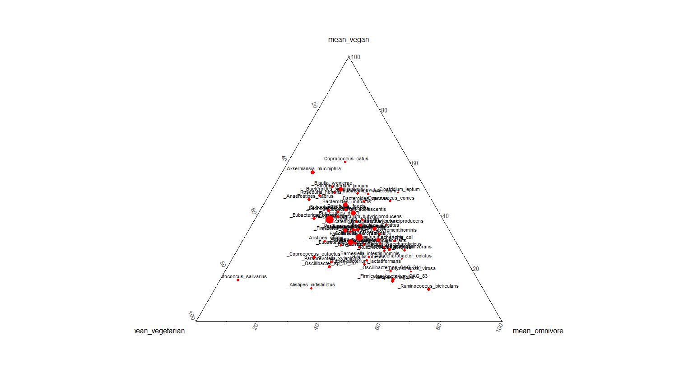
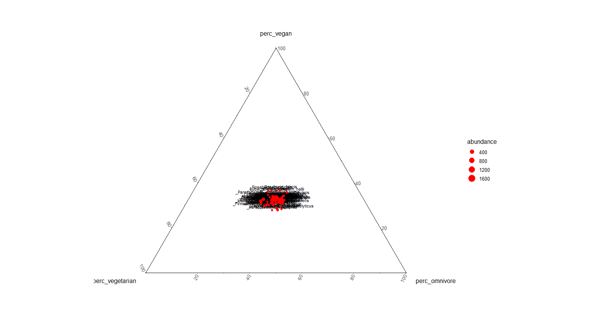
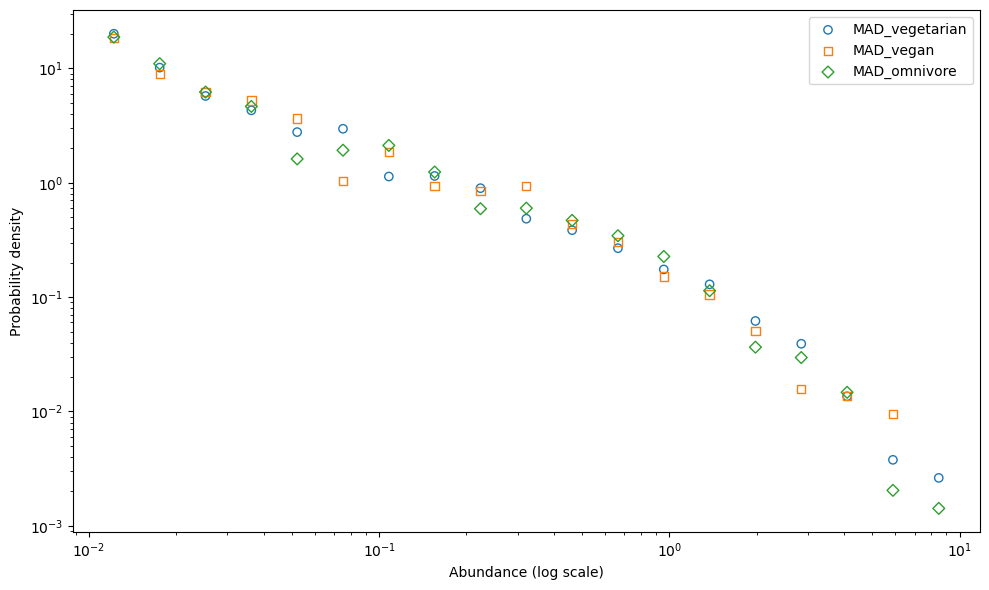

Modelling how the diet drives the gut microbiota and how we can make prediction on the gut microbiota changing the diet. 

1. The first one is the development of a a model in a simplified system (i.e. C. elegans) which microbiota can be easily monitored. The idea was to study the species that are found in C. elegans and the metabolism of those species to parametrize for each species the growth rate on the diet. We discussed the possibility of build up a new experiment or to study already published data. This methodology can be good to understand really which exact species is driven by which diet, but we criticized the difficulty to scale up to a different system (i.e. human) where there are bigger communities.

2. The second one is to explore the human gut microbiota communities in terms of species abundance distribution and frequency abundance distribution. The idea is to review already published data about how gut species abundances are distributed in different diets and then compare it with the species abundance distributions found in the model simulations. With this methodology the aim is to predict how the diet drives the microbiota abundance distribution (if it does!), but not taxonomically naming the species.

##

#### Does the diet variate the gut microbiota?
#### Hypothesis:

##### 1. The diet variates the abundance distribution of the gut microbiota

Questions:

-  More polysaccharides mean more dilution so less diversity?

-  An animal-based diet means more specialized microbiota so less diversity?

- Different diets correspond to different shapes in gut microbiota abundance distributions?

- Different diets correspond to the same shape in gut microbiota abundance distribution but to the different slope?

IT DOES NOT VARIATE THE ABUNDANCE DISTRIBUTION SEE "Data approaches.md"

##### 2. The diet variates the taxonomy of the gut microbiota and not the abundances

   - Are there some microbial groups that segregate in different diets?

 I tried to explore if the species classifies depending on the diet type and if they order in the bidimensional space. Clustering analysis and different techniques of ordination were conducted but not all of them enabled classification and ordination

For example, the CAP, Canonycal analysis of principal coordinates: A useful method of costrained ordination for ecology, enables us to see segregation. CAP Canonycal analysis of principal coordinates based on discriminant analysis: this method uses the diet as a constraint, and we can see that some species segregates into different diets (Fig. 4).

 Fig. 4: CAP analysis based on the species and on the individuals with the constraint of the diet. The blue, red and green triangles represent the individuals that were under a vegetarian, omnivore and vegan diet, respectively.

I had a look to other papers about the topic, and they use usually as ordination not just PCA but nMDS or PCA with other methods (Coinertia analysis) and they obtain segregation.
For example, in De Filippis et al., 2019 "High-level adherence to a Mediterranean diet beneficially impacts the gut microbiota and associated metabolome", they calculated the Pairwise Spearman correlations were calculated between microbial genera, dietary and metabolome datasets and then the correlation plots were visualized and clusterd in R.
And moreover, for the ordination: In order to explore the relationship between the genus-level microbiota and the dietary datasets, they carried out principal components analysis (PCA) on the individual datasets and then integrated them using coinertia analysis (CIA),39 which allows identification of the shared biological trends within the two datasets.
Again, Rampelli et al 2015, "Metagenome Sequencing of the Hadza Hunter-Gatherer Gut Microbiota" did the hierarchical clustering based on the spearman correlation coefficients of the KEGG Orthology (KO) gene count, filtered for subject presence ≥100 in at least 20% subjects. and Hierarchical Ward-linkage clustering based on the Spearman correlation coefficients of the KO gene counts, filtered for subject presence in at least 50% of subjects.

To conclude, there are two scales of problems:
1. Data used: Is there a difference between 16S and metagenomic data?
2. Method used: does different methodology give the same result or not?

We then tried to plot the species abundances in a three phase diagram (Fig. 5). We mediated all the individuals for the three type of diet and then we plotted the abundance of all the species across the three type of diet. In the middle there are the species that occur in the three diets, while in the angles the one that occur more in one of the three diets. The vegan and the omnivore share less species than the omnivore and vegetarian and the most of the species are shared between vegetarian and vegan.   

 
Fig. 5: Three phases diagram based on the abundance of the species inside the three group. The circles represents the species.

Occurrence filter from 50% to 100%
 
Fig5 with occurrence per diet  All the diets need to satisfy the occurrence criterion
independently. The occurrence of each group is set to be between 50% and 100%

###### Occurrence as coordinate

 
New Figure 5 The behaviour of species occurrence per diet: instead of using the
average abundance as a coordinate use the occurrence

Occurrence filter from 50% to 100%

 
New Figure 5 The behaviour of species occurrence per diet: instead of using the
average abundance as a coordinate use the occurrence but selecting just the species that occurre between the 50% and the 100% of the samples

Occurrence filter from 0 to 30
 
New Figure 5 The behaviour of species occurrence per diet: instead of using the
average abundance as a coordinate use the occurrence but selecting just the species that occurre between the 0% and the 30% of the samples

##### Geometrical Mean 
 
Fig. 6 Same as before but using the geometric mean abundance among samples where the
species is present as a coordinate

###### MADs and AFDs
Select the species that occur in all (almost? the samples (per diet or total) compute the MAD Mean Abundance Distribution) and the AFD Abundance Fluctuation Distribution... or Alternative Fur Deutschland) from Grilli 2020 we expect
that MAD is Lognormal, AFD is Gamma.

 

Fig. 7 the Mean Abundance Distribution (MAD) in three type of diets. For each diet, the mean of across samples were computed and then the histogram of each mean were plotted. Each point represents the probability of the species to exist with the current abundance 

** The species in the abundance class 1e-1 are variates more between the diets than the species in the higher abundance class or in the lower abundance class (?)**

 

Fig. 8 The Abundance Fluctuation Distribution AFD of the most current species

 

Fig. 8B The Abundance Fluctuation Distribution AFD of less current species

###### SPECIES ABUNDANCE VARIANCE ACROSS THE DIETS
Select species that are present in most of the samples (independently of the diet).
Compare the species abundance variance within a diet, across different diets.

 

Fig. 9  Species abundance variances of the omnivore diet vs vegetarian diet

 

Fig. 10  Species abundance variances of the omnivore diet vs vegan diet

 

Fig. 11  Species abundance variances of the omnivore diet vs vegan diet

##### 3. The health condition variates the abundance distribution of the gut microbiota
No progress

