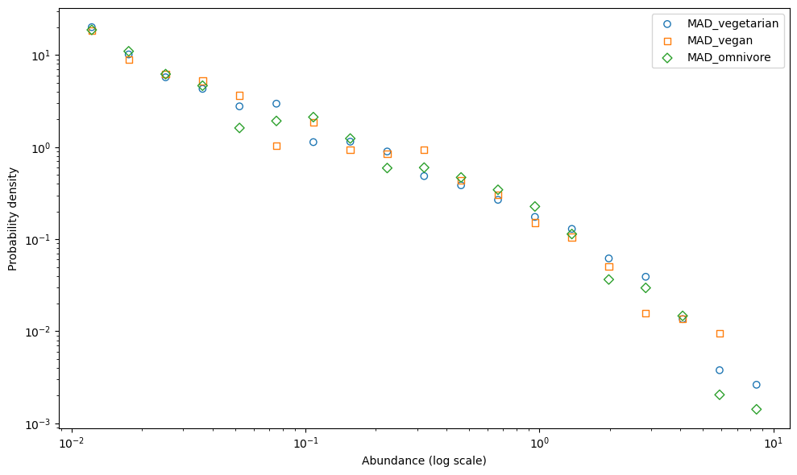

Modelling how the diet drives the gut microbiota and how we can make prediction on the gut microbiota changing the diet. 

1. The first one is the development of a a model in a simplified system (i.e. C. elegans) which microbiota can be easily monitored. The idea was to study the species that are found in C. elegans and the metabolism of those species to parametrize for each species the growth rate on the diet. We discussed the possibility of build up a new experiment or to study already published data. This methodology can be good to understand really which exact species is driven by which diet, but we criticized the difficulty to scale up to a different system (i.e. human) where there are bigger communities.

2. The second one is to explore the human gut microbiota communities in terms of species abundance distribution and frequency abundance distribution. The idea is to review already published data about how gut species abundances are distributed in different diets and then compare it with the species abundance distributions found in the model simulations. With this methodology the aim is to predict how the diet drives the microbiota abundance distribution (if it does!), but not taxonomically naming the species.

##

#### Does the diet variate the gut microbiota?
#### Hypothesis:

##### 1. The diet variates the abundance distribution of the gut microbiota

Questions:

-  More polysaccharides mean more dilution so less diversity?

-  An animal-based diet means more specialized microbiota so less diversity?

- Different diets correspond to different shapes in gut microbiota abundance distributions?

- Different diets correspond to the same shape in gut microbiota abundance distribution but to the different slope?

IT DOES NOT VARIATE THE ABUNDANCE DISTRIBUTION SEE "Data approaches.md"

As metagenomic data are nonnegative data carrying relative, rather than absolute, information-- we treat them with Compositional data analysis-- a statistical approach designed specifically to handle data where the components are proportions that sum to a costant (usually 1)
High-throughput sequencing (HTS) microbiome data are compositional — meaning that only the relative abundance of features is available, not their absolute counts. This compositionality is inherent due to the fixed read depth of sequencing instruments. 

# Center Log-Ratio (CLR) Transformation

Given a composition $\mathbf{x} = (x_1, x_2, \ldots, x_s)$ such that:

$$
\sum_{i=1}^{s} x_i = 1 \quad \text{and} \quad x_i > 0 \quad \forall i,
$$

the **Center Log-Ratio (CLR)** transformation is defined as:

$$
c_i = \log\left( \frac{x_i}{g(\mathbf{x})} \right)
$$

This transformation maps compositional data from the simplex to a real Euclidean space, enabling standard statistical techniques to be applied more appropriately.

CLR cannot be applied directly when any $x_i = 0$ due to the logarithm and geometric mean being undefined in that case. 
> ⚠️ **Note**: 📊 **Mean Comparisons**
>
> #### ✅ Arithmetic Mean
>
> The arithmetic mean is the standard average:  
> $\text{Arithmetic Mean} = \frac{x_1 + x_2 + \dots + x_n}{n}$
>
> ---
>
> #### ✅ Geometric Mean
>
> The geometric mean is the nth root of the product of the values:  
> $\text{Geometric Mean} = \sqrt[n]{x_1 \cdot x_2 \cdot \dots \cdot x_n}$
>
> ---
>
> #### ✅ Geometric Mean in Log Space
>
> This is a numerically stable way to compute the geometric mean using logarithms:  
> $\text{Geometric Mean} = \exp\left( \frac{1}{n} (\log x_1 + \log x_2 + \dots + \log x_n) \right)$
>
> This works because:  
> $\log\left( \sqrt[n]{x_1 \cdot x_2 \cdot \dots \cdot x_n} \right) = \frac{1}{n} (\log x_1 + \log x_2 + \dots + \log x_n)$

CLR values indicate how much a component deviates (log-ratio-wise) from the geometric mean of all parts.

A positive CLR value → the component is larger than the average (geometrically).

A negative CLR value → the component is smaller than the average (geometrically).

## Compositional data
>note: such as the data without the centered log trasformation
>* The arithmetic mean doesn't have sense because any high value or low value of some taxa is automatically related with a corrispetive lower or higher value of another taxa.
>* Put the figure of the triangle with the geometric mean

## Centred log trasformed data
>note: such as the data with the centered log trasformation
>* Plot the triangles (arithmetic mean, variance, standard deviation)
>* Plot one diet against the other in terms of: arithmetic mean, variance, standard deviation
>* Plot one health condition against the other in terms of: arithmetic mean, variance standard deviation 

### 2. The diet variates the gut microbiota
The first data I used belong to the paper: "Mediterranean diet intervention in overweight and obese subjects lowers plasma cholesterol and causes changes in the gut microbiome and metabolome independently of energy intake." Meslier V, et al. Gut 2020 doi:10.1136/gutjnl-2019-320438 The experiment consisted of 82 subject with the obese condition. It was conducted for 8 weeks, there is the timeline from 0, 4, 8 weeks. In the initial time they were all the same. They started from a diet that was Western diet and then the half of them where under Mediterranean diet. 

#### MADs
> Note: Select the species that occur in all (almost? the samples (per diet or total) compute the MAD Mean Abundance Distribution) and the AFD Abundance Fluctuation Distribution... or Alternative Fur Deutschland) from Grilli 2020 we expect
that MAD is Lognormal, AFD is Gamma.

 

Fig. 1 the Mean Abundance Distribution (MAD) in three type of diets. For each diet, the mean of across samples were computed and then the histogram of each mean were plotted. Each point represents the probability of the species to exist with the current abundance 

** The species in the abundance class 1e-1 are variates more between the diets than the species in the higher abundance class or in the lower abundance class (?)**

#### Abundance Fluctuation Distribution (AFD)

1. Normalized abundance of species *i* in sample *s*:
   
   It is defined as the relative abundance of species *i* in sample *s*, divided by the **mean abundance** of that species across all samples:

   $$
   \tilde{x}_{i,s} = \frac{x_{i,s}}{\langle x_i \rangle}
   $$

2. Log-transform the normalized abundance:

   $$
   \log_{10}(\tilde{x}_{i,s}) = \log_{10}\left( \tilde{x}_{i,s} \right)
   $$

3. Plot the log-transformed normalized abundance values in **linear X-axis and log-scaled Y-axis (i.e., linear space for X, log-scale for frequency/density).

   This shows the distribution of $\log_{10}(\tilde{x}_{i,s})$ as an approximation of the species' Abundance Fluctuation Distribution (AFD), and allows visual comparison with a theoretical Gamma distribution.

 
Fig. 2 The Abundance Fluctuation Distribution AFD of less current species

 
Fig. 3  Species  mean of the omnivore diet vs vegan diet
 
Fig. 4  Species mean of the omnivore diet vs vegetarian diet
 
Fig. 5  Species mean of the vegetarian diet vs vegan diet

 
Fig. 6  Species variances of the omnivore diet vs vegan diet
 
Fig. 7  Species variances of the omnivore diet vs vegetarian diet
 
Fig. 8  Species variances of the vegetarian diet vs vegan diet

 
Fig. 9  Three-phase diagram of the mean across the diets. The mean was evaluated on the log-centered data and then per each species each value inside the diet was normalized.
 
Fig. 10  Three-phase diagram of the variance across the diets. The variance was evaluated on the log-centered data and then per each species each value inside the diet was normalized.
 
Fig. 11  Three-phase diagram of the sd across the diets. The sd was evaluated on the log-centered data and then per each species each value inside the diet was normalized.

##### 3. The health condition variates the abundance distribution of the gut microbiota
 
Fig. 12  Species Mean of the omnivore diet vs vegan diet
 
Fig. 13  Species standard deviation of the omnivore diet vs vegetarian diet
 
Fig. 14  Species variances of the vegetarian diet vs vegan diet

