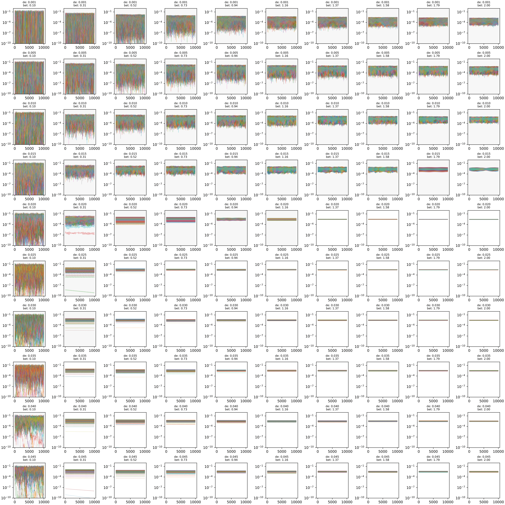
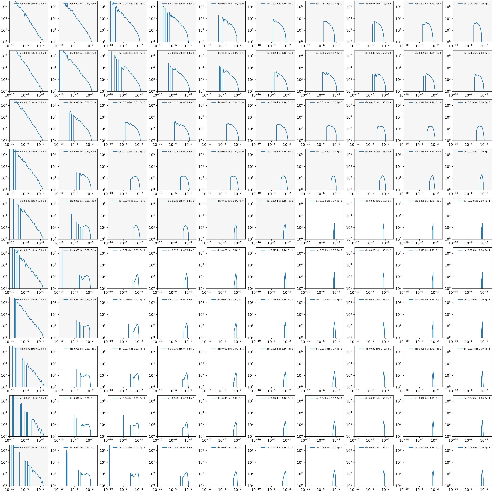
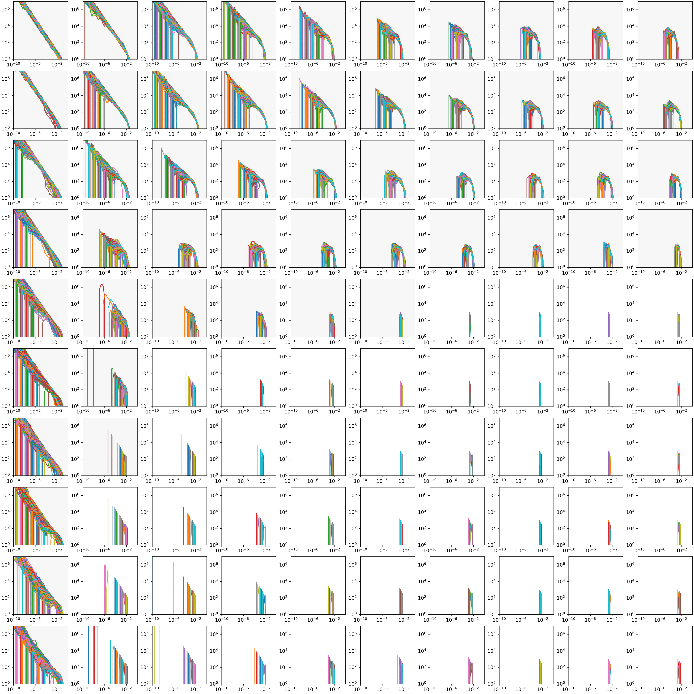
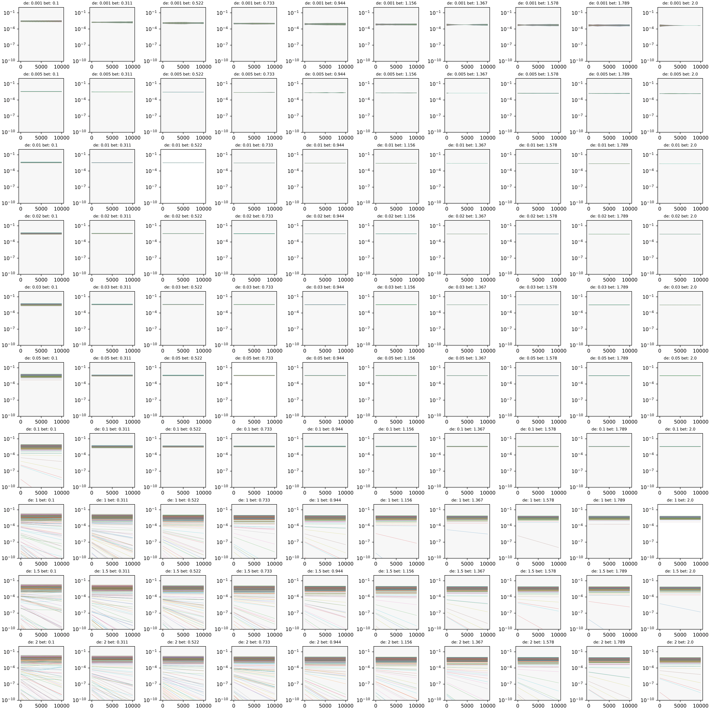
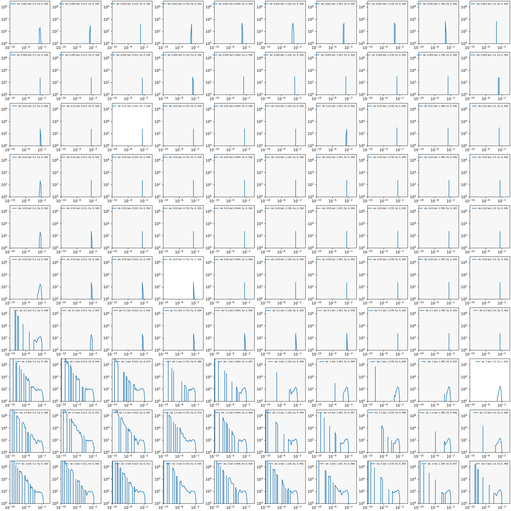

# EQUATIONS $$ 1.\ \frac{\dot{n}_i}{n_i} = g (1- {\rho} a_i ) - \sum_{j= i} C_{ij} n_j) \ $$ $$ C_{ii} = 1 $$ $$ 2.\ \dot{a}_i = \beta n_i - \frac{1}\tau a_i. $$ # Simulations $$ Cij= N \sim 0.5,0.3;\\\\diag=1;\\\\delta=\frac {1}{\tau} $$ # Chaotic phase # Species abundance in time

|                   |                                            |
| ----------------- | ------------------------------------------ |
| Species Abundance |  |
| Time              |                                            |
|                   |                                            |

#SADs Species abundance distributions in the final time step

|                   |                                      |
| ----------------- | ------------------------------------ |
| Prob. density     |  |
| Species Abundance |                                      |

#AFDs Abundance Fluctuation Distribution in all the species

|                   |                                      |
| ----------------- | ------------------------------------ |
| Prob. density     |  |
| Species Abundance |                                      |

# Fixed Points Phase Cij= N~0.5,0.03; diag=1 #Species abundance in time

|                   |                                                    |
| ----------------- | -------------------------------------------------- |
| Species Abundance |  |
| Time              | Time                                               |

#SADs Species abundance distributions in the final time step

|                   |                                                   |
| ----------------- | ------------------------------------------------- |
| Prob. density     |  |
| Species Abundance |                                                   |

#AFDs Abundance Fluctuation Distribution in all the species

|                   |                                                   |
| ----------------- | ------------------------------------------------- |
| Prob. density     |  |
| Species Abundance |                                                   |
