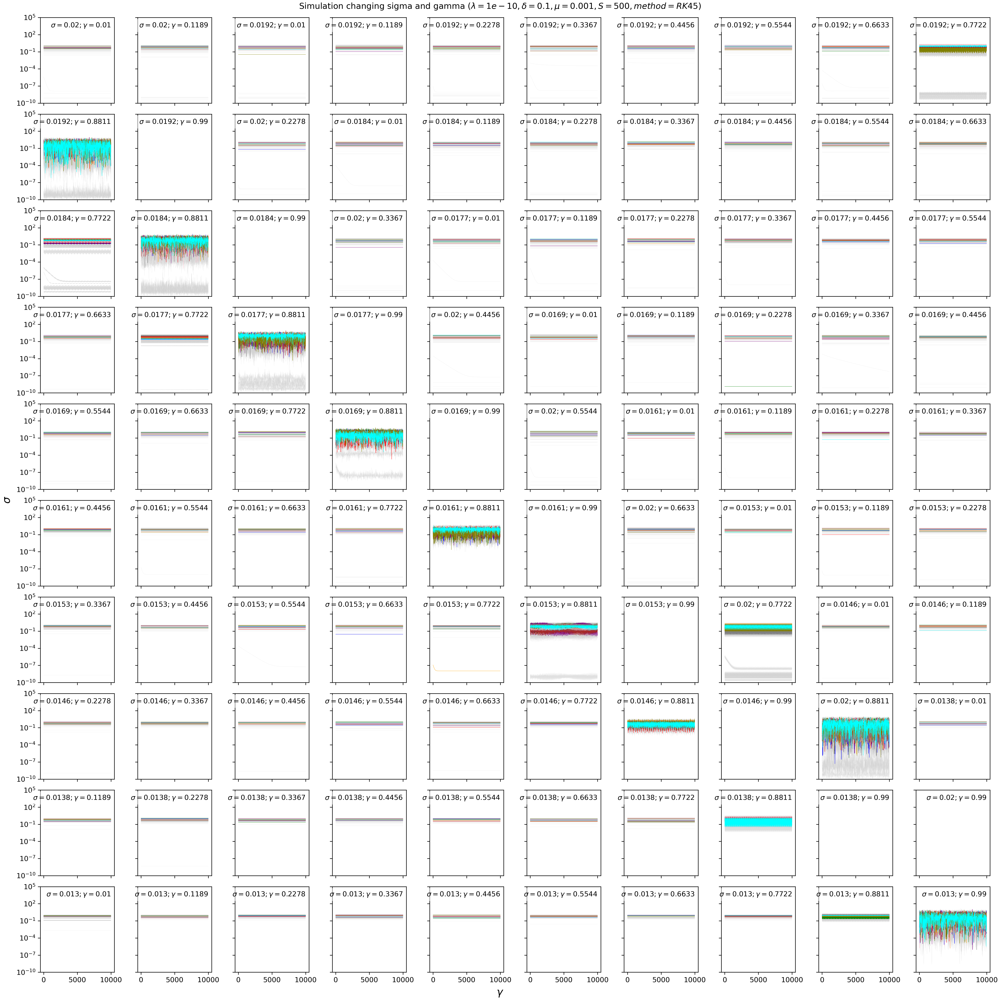
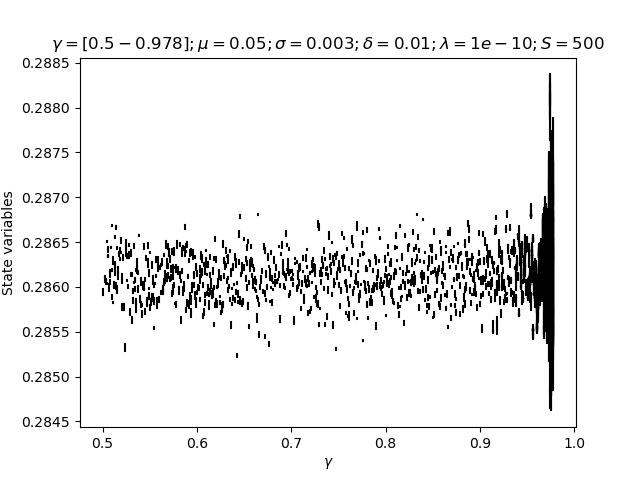

 EQUATIONS 
 
 $$
\dot{n}_i = n_i\Big[ 1 - \Big(\gamma \delta a_i + (1-\gamma)n_i\Big) - \sum_{j(\neq i)} C_{ij} n_j \Big]+ \lambda

$$

$$

\dot{a}_i = n_i - \delta a_i

$$
We draw $C_{ij}\sim \mathcal{N}(\mu,\sigma)$, i.e. not with weak interaction scaling. In the end there are (beside species richness $S$) four continuous parameters to study: $\mu,\sigma,\delta,\gamma$ 

SIMULATIONS -Fixing $\mu$ and $\sigma$ and changing $\gamma$ and $\delta$ 

 
$$ Cij = N \sim 0.4,0.2;\ \gamma=[0-1];\ \delta= [0.001-2];\ \lambda= 1e-10\ S=500 $$
*Memo for me: it is the folder called "DatChParNew"*

SPECIES DYNAMICS 

I have parametrised the new model by using the old parameters, scaling the parameters in the new way (see. Notes Autotoxicity model by Emil). If $\beta=1$ and  $\delta$ = 0.001 (in the past version of the model, as in the past parametrisation), then,  $Cii$ = 100. This means that in the new parametrisation $\mu$ and $\sigma$ are not 0.5 and 0.3 but are divided by $Cii$ resulting in a change of the phase regime from chaotic to fixed points.
$$ Cij = N \sim 0.005,0.003;\ \gamma=[0.8-1];\ \delta= [0.001-2];\ \lambda= 0 $$
*Memo for me: it is the folder called "DatFpParNew"*

SIMULATIONS - Fixing $\gamma$ and $\delta$ and changing $\mu$ and $\sigma$ 
I fixed $\gamma$ =0.1 and $\delta$ = 0.1 and then I changed $\mu$ and $\sigma$ as the function of the angle $\phi$ 
I changed $\phi$ from 0.1 to 1.6 radians.

$$ Cij = N \sim \mu(\phi),\sigma(\phi)\ ;\ \phi = [0.1-1.6]; \gamma=0.5;\ \delta= 0.1;\ \lambda= 1e-10\  $$

*Memo for me: it is the folder called "Dat_Phi3" Simulations with LSODA method*

From the top left to the bottom right, phi values decrease. The behaviour of only 10 random species is shown in colour, while the other species are shown in grey. Despite the numerical error, we can see that the species fluctuate faster as the phi value increases.

SIMULATIONS - Fix $\mu$ and $\delta$ and $\gamma$ and change $\sigma$. 

We now consider the space $\mu$ and $\sigma$ as in  Ecological communities with Lotka-Volterra dynamics; DOI: https://doi.org/10.1103/PhysRevE.95.042414. In our case mu and sigma are $\hat{\mu} = S \mu$ and $\hat{\sigma} = \sqrt{S} \sigma $
In this case it will change to the Unique Fixed Points regime where the values of $\mu$ and $\sigma$ are smaller (0.005 and 0.001). The point is to change $\sigma$, to see if we get into the multiple attractor phase.

$$ 
Cij = N \sim (\mu ,\sigma) ;\  \mu=0.001;\ \sigma=[0.002-0.013];\ \gamma=[0.01-0.99];\ \delta= 0.01;\ \lambda= 1e-10\  
$$

*In the simulation upside, I got some problem sorting the data, I will try to figure it out*

1. Change the model by using instead of $\gamma$ a parameter called $\theta$ that represents the sensibility to the Toxicity. 
$$
\dot{n}_i = n_i\Big[ 1 - \Big(\Theta a_i + (1-\frac{\Theta}{\delta})n_i\Big) - \sum_{j(\neq i)} C_{ij} n_j \Big] 
$$
$$
\dot{a}_i = n_i - \delta a_i
$$ 
In the end there are (beside species richness $S$) four continuous parameters to study: $\mu,\sigma,\delta,\Theta$ where $\Theta$ is now defined as $\theta = \gamma \delta$. Note that in this new parametrization is always $\Theta<\delta$ to avoid negative values of $n_i$

2. Fix $\mu$ and $\sigma$ and change $\theta$ where $\theta$ is the sensibility to the toxicity

For the moment I am keeping $\gamma$

3. Bifurcation analysis

I tried a bifurcation analysis changing the parameter $\gamma$  from 0.5 to 0.978

This is an example of the code that I used.

    for idx in range(len(ChPar_list)): # a for on the parameter gamma
        # Executing the simulation for all the parameters idx
        m.gam = ChPar_list[idx]

        m.B = ab.gaussian_interactions(m.S, m.mu, m.sigma, diag=0, rng=rng) # interaction matrix

        # initial condition f_logAuto
        # on the first cycle i put the initial condition. Then I will use the last state variable condition as the first condition for the next parameter: maybe is not necessary because it is implicit in the model class?
        if idx == 0:
            logn1 = np.log(1 / m.S)
            m.s = np.zeros(2 * m.S)
            m.s[:m.S] = logn1 
            m.s[m.S:] = np.ones(m.S)/m.S  

        trans_long= 10000 # transient time

        m.run(trans_long, method=meth) # run long transient
        trans_short= 400
        #while (m.theta<m.de):
        t, st = m.run(trans_short,1,method=meth)
        nt = np.exp(st[:m.S,:]) # rexponentiate because of log the abundances
        at = st[m.S:,:] #the autotoxicity
        ntmean= np.mean(nt,axis=0)
        N=trans_short

        MinMax= ab.findLocalMaximaMinima(n=N,arr=ntmean)
        max_nmean= ntmean[MinMax[0]]
        min_nmean= ntmean[MinMax[1]]
        #print(ab.integrate.LAST_SOLVER_MSG)
        #print(ab.integrate.LAST_SOLVER_STATUS)

        #np.savez(f"C:/Users/spigno/Documents/Dat_BifurcationGamma4/dat_{idx}.npz", ntmean=ntmean, nt=nt, at= at, gamma=m.gam, S=m.S, lam = m.lam,de = m.de, max_nmean=max_nmean, min_nmean=min_nmean)
        m.s = st[:, -1]  # to use the last state as initial condition # is it useful??
        
        
Notes: I do not know how to plot the bifurcation to be continuous, for example, for a parameter of gamma to keep for some time the same value of the state variable, and then change it and stay a bit with the new parameter...
