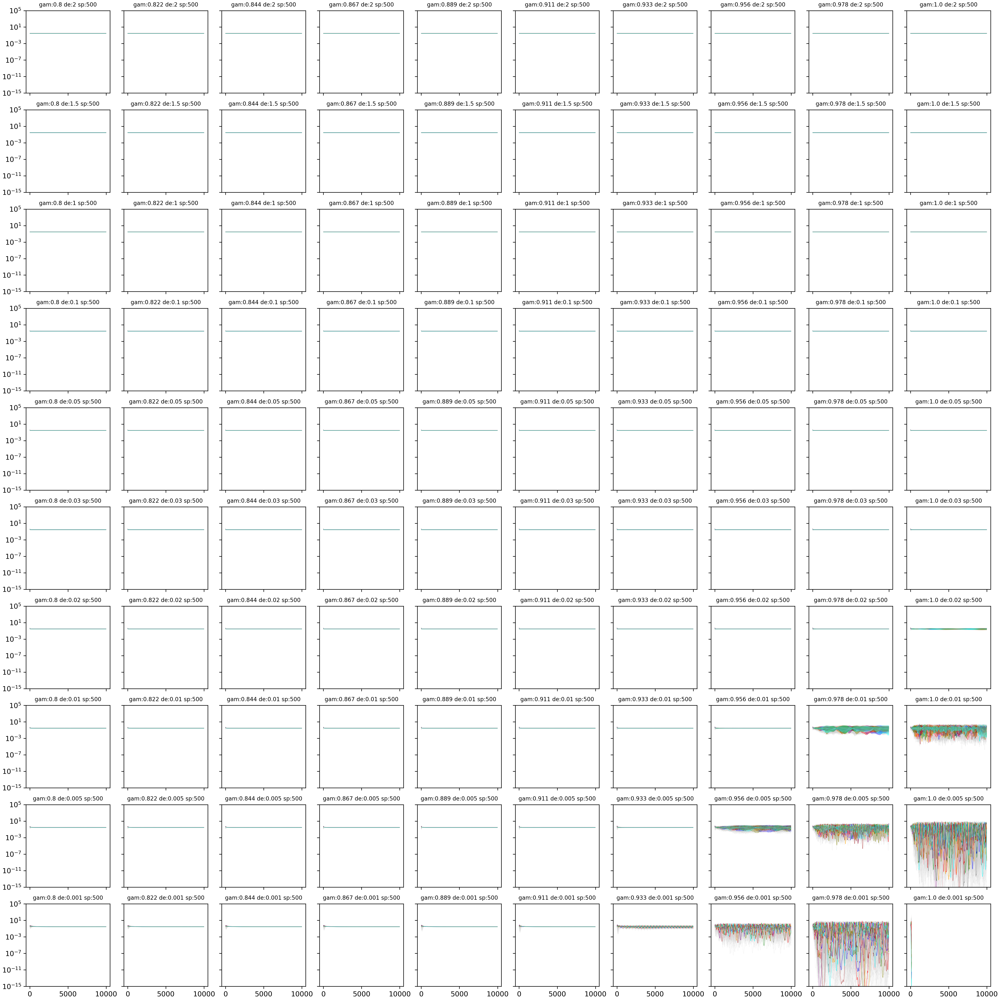

 EQUATIONS 
 
 $$
\dot{n}_i = n_i\Big[ 1 - \Big(\gamma \delta a_i + (1-\gamma)n_i\Big) - \sum_{j(\neq i)} C_{ij} n_j \Big]+ \lambda

$$

$$

\dot{a}_i = n_i - \delta a_i

$$
We draw $C_{ij}\sim \mathcal{N}(\mu,\sigma)$, i.e. not with weak interaction scaling. In the end there are (beside species richness $S$) four continuous parameters to study: $\mu,\sigma,\delta,\gamma$ 

SIMULATIONS -Fixing $\mu$ and $\sigma$ and changing $\gamma$ and $\delta$ 

 
$$ Cij = N \sim 0.4,0.2;\ \gamma=[0-1];\ \delta= [0.001-2];\ \lambda= 1e-10\ S=500 $$
*Memo for me: it is the folder called "DatChParNew"*

SPECIES DYNAMICS 

I have parametrised the new model by using the old parameters, scaling the parameters in the new way (see. Notes Autotoxicity model by Emil). If $\beta=1$ and  $\delta$ = 0.001 (in the past version of the model, as in the past parametrisation), then,  $Cii$ = 100. This means that in the new parametrisation $\mu$ and $\sigma$ are not 0.5 and 0.3 but are divided by $Cii$ resulting in a change of the phase regime from chaotic to fixed points.
$$ Cij = N \sim 0.005,0.003;\ \gamma=[0.8-1];\ \delta= [0.001-2];\ \lambda= 0 $$
*Memo for me: it is the folder called "DatFpParNew"*

Now I plot the same simulation but showing just ten species' behavior in color and the others in grey

SIMULATIONS - Fixing $\gamma$ and $\delta$ and changing $\mu$ and $\sigma$ 
I fixed $\gamma$ =0.1 and $\delta$ = 0.1 and then I changed $\mu$ and $\sigma$ as the function of the angle $\phi$ 
I changed $\phi$ from 0.1 to 1.6 radians.

$$ Cij = N \sim \mu(\phi),\sigma(\phi)\ ;\ \phi = [0.1-1.6]; \gamma=0.5;\ \delta= 0.1;\ \lambda= 1e-10\  $$

*Memo for me: it is the folder called "Dat_Phi2"*

From the top left to the bottom right, phi values decrease. The behaviour of only 10 random species is shown in colour, while the other species are shown in grey. Despite the numerical error, we can see that the species fluctuate faster as the phi value increases.

SIMULATIONS - Fix $\mu$ and $\delta$ and $\gamma$ and change $\sigma$. 

We now consider the space $\mu$ and $\sigma$ as in  Ecological communities with Lotka-Volterra dynamics; DOI: https://doi.org/10.1103/PhysRevE.95.042414. In our case mu and sigma are $\hat{\mu} = S \mu$ and $\hat{\sigma} = \sqrt{S} \sigma $
In this case it will change to the Unique Fixed Points regime where the values of $\mu$ and $\sigma$ are smaller (0.005 and 0.001). The point is to change $\sigma$, to see if we get into the multiple attractor phase.

$$ 
Cij = N \sim (\mu ,\sigma) ;\  \mu=0.001;\ \sigma=[0.002-0.013];\ \gamma=0.9;\ \delta= 0.01;\ \lambda= 1e-10\  
$$

The same graph of the species abundances but zoomed

Next steps:
1. Change the model by using instead of $\gamma$ a parameter called $\theta$ that represents the sensibility to the Toxicity. 
$$
\dot{n}_i = n_i\Big[ 1 - \Big(\Theta a_i + (1-\frac{\Theta}{\delta})n_i\Big) - \sum_{j(\neq i)} C_{ij} n_j \Big] 
$$
$$
\dot{a}_i = n_i - \delta a_i
$$ 
In the end there are (beside species richness $S$) four continuous parameters to study: $\mu,\sigma,\delta,\Theta$ where $\Theta$ is now defined as $\theta = \gamma \delta$. Note that in this new parametrization is always $\Theta<\delta$ to avoid negative values of $n_i$

2. Fix $\mu$ and $\sigma$ and change $\theta$ where $\theta$ is the sensibility to the toxicity

3. Bifurcation analysis changing $\theta$. From a fixed point regime, fixing all the other parameters, change just delta and evaluate the state variables local minima and maxima for the mean of the species in a certain time step 