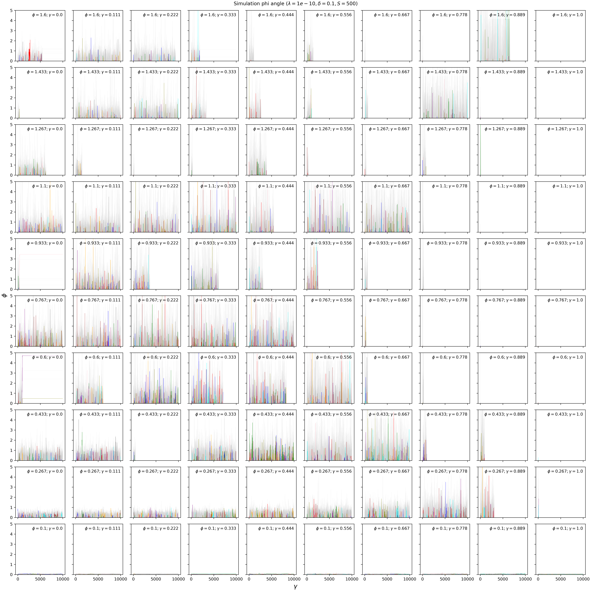
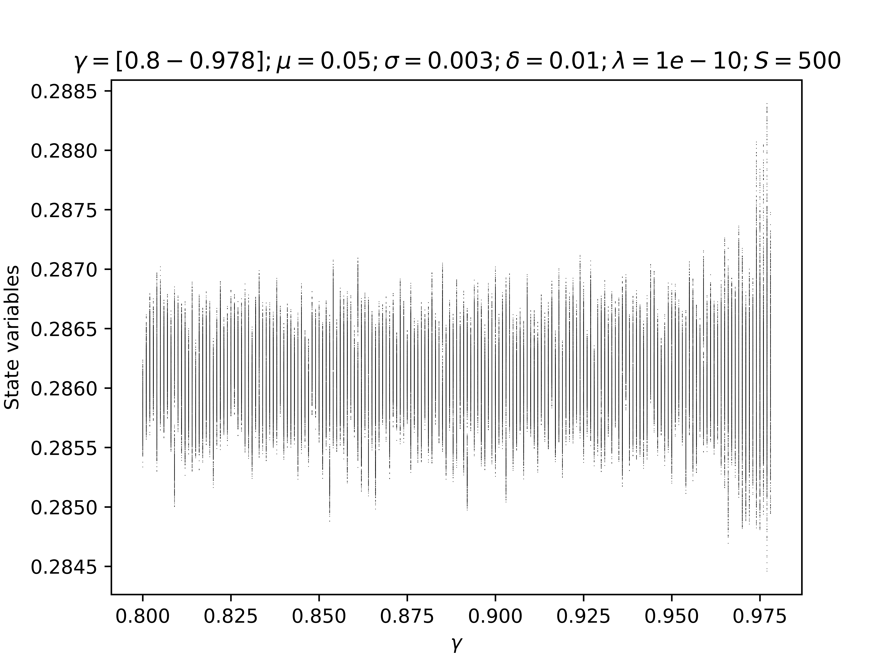
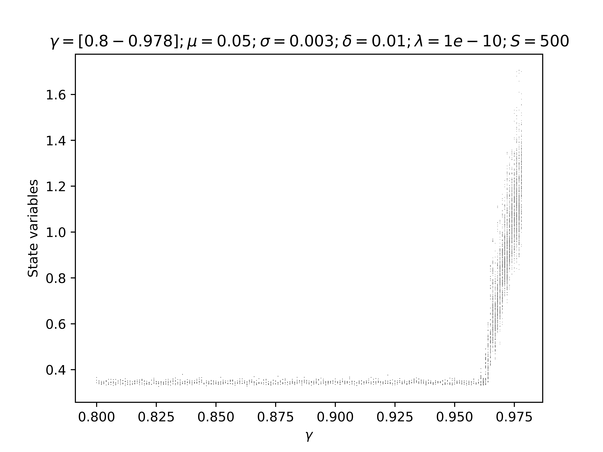
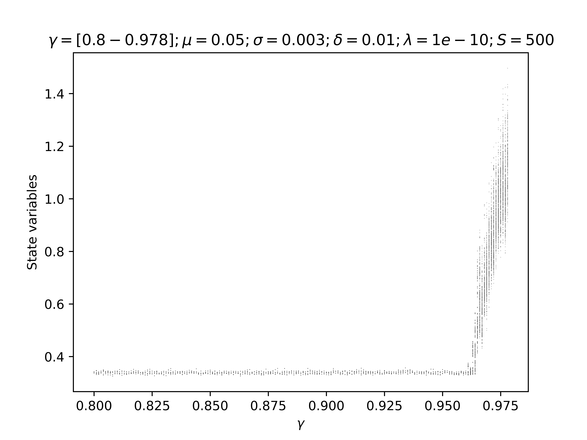

 EQUATIONS 
 
 $$
\dot{n}_i = n_i\Big[ 1 - \Big(\gamma \delta a_i + (1-\gamma)n_i\Big) - \sum_{j(\neq i)} C_{ij} n_j \Big]+ \lambda

$$

$$

\dot{a}_i = n_i - \delta a_i

$$
We draw $C_{ij}\sim \mathcal{N}(\mu,\sigma)$, i.e. not with weak interaction scaling. In the end there are (beside species richness $S$) four continuous parameters to study: $\mu,\sigma,\delta,\gamma$ 

SIMULATIONS -Fixing $\mu$ and $\sigma$ and changing $\gamma$ and $\delta$ 

 
$$ Cij = N \sim 0.4,0.2;\ \gamma=[0-1];\ \delta= [0.001-2];\ \lambda= 1e-10\ S=500 $$
*Memo for me: it is the folder called "DatChParNew"*

SPECIES DYNAMICS 

Now the plot of the same simulation but in Linear scale

I have parametrised the new model by using the old parameters, scaling the parameters in the new way (see. Notes Autotoxicity model by Emil). If $\beta=1$ and  $\delta$ = 0.001 (in the past version of the model, as in the past parametrisation), then,  $Cii$ = 100. This means that in the new parametrisation $\mu$ and $\sigma$ are not 0.5 and 0.3 but are divided by $Cii$ resulting in a change of the phase regime from chaotic to fixed points.
$$ Cij = N \sim 0.005,0.003;\ \gamma=[0.8-1];\ \delta= [0.001-2];\ \lambda= 0 $$
*Memo for me: it is the folder called "DatFpParNew"*

Now the plot of the same simulation but in Linear scale

SIMULATIONS - Fixing $\gamma$ and $\delta$ and changing $\mu$ and $\sigma$ 
I fixed $\gamma$ =0.1 and $\delta$ = 0.1 and then I changed $\mu$ and $\sigma$ as the function of the angle $\phi$ 
I changed $\phi$ from 0.1 to 1.6 radians.

$$ Cij = N \sim \mu(\phi),\sigma(\phi)\ ;\ \phi = [0.1-1.6]; \gamma=0.5;\ \delta= 0.1;\ \lambda= 1e-10\  $$

*Memo for me: it is the folder called "Dat_Phi3" Simulations with LSODA method*

From the top left to the bottom right, phi values decrease. The behaviour of only 10 random species is shown in colour, while the other species are shown in grey. Despite the numerical error, we can see that the species fluctuate faster as the phi value increases.

Now the plot of the same simulation but in Linear scale

Now I made the same simulation but plotting the species by changing phi in the same graph.

SIMULATIONS - Fix $\mu$ and $\delta$ and $\gamma$ and change $\sigma$. 

We now consider the space $\mu$ and $\sigma$ as in  Ecological communities with Lotka-Volterra dynamics; DOI: https://doi.org/10.1103/PhysRevE.95.042414. In our case mu and sigma are $\hat{\mu} = S \mu$ and $\hat{\sigma} = \sqrt{S} \sigma $
In this case it will change to the Unique Fixed Points regime where the values of $\mu$ and $\sigma$ are smaller (0.005 and 0.001). The point is to change $\sigma$, to see if we get into the multiple attractor phase.

$$ 
Cij = N \sim (\mu ,\sigma) ;\  \mu=0.001;\ \sigma=[0.002-0.013];\ \gamma=[0.01-0.99];\ \delta= 0.01;\ \lambda= 1e-10\  
$$

Now I plot the same simulation but in Linear scale

1. Change the model by using instead of $\gamma$ a parameter called $\theta$ that represents the sensibility to the Toxicity. 
$$
\dot{n}_i = n_i\Big[ 1 - \Big(\Theta a_i + (1-\frac{\Theta}{\delta})n_i\Big) - \sum_{j(\neq i)} C_{ij} n_j \Big] 
$$
$$
\dot{a}_i = n_i - \delta a_i
$$ 
In the end there are (beside species richness $S$) four continuous parameters to study: $\mu,\sigma,\delta,\Theta$ where $\Theta$ is now defined as $\theta = \gamma \delta$. Note that in this new parametrization is always $\Theta<\delta$ to avoid negative values of $n_i$

2. Fix $\mu$ and $\sigma$ and change $\theta$ where $\theta$ is the sensibility to the toxicity

*For the moment I am keeping $\gamma$*

3. Bifurcation analysis

I tried a bifurcation analysis changing the parameter $\gamma$  from 0.8 to 0.978
#### Plotting the mean of all the species

#### Plotting the most abundant species

#### Plotting the second most abundant species

#### Plotting the third most abundant species

This is an example of the code that I used.

    for idx in range(len(ChPar_list)):
    # Executing the simulation for all the parameters idx
    m.gam = ChPar_list[idx]

    m.B = ab.gaussian_interactions(m.S, m.mu, m.sigma, diag=0, rng=rng) # interaction matrix

    # initial condition f_logAuto
     # Se è il primo ciclo, imposta la condizione iniziale
    if idx == 0:
        logn1 = np.log(1 / m.S)
        m.s = np.zeros(2 * m.S)
        m.s[:m.S] = logn1 
        m.s[m.S:] = np.ones(m.S)/m.S  # Autotossicità iniziale

    trans_long= 10000 # transient time

    m.run(trans_long, method=meth) # run long transient
    trans_short= 400
    #while (m.theta<m.de):
    t, st = m.run(trans_short,1,method=meth)
    nt = np.exp(st[:m.S,:]) # rexponentiate because of log the abundances
    at = st[m.S:,:] #the autotoxicity
    ntmeanR= np.mean(nt,axis=0)
    ntsort=np.sort(nt, axis=0)
    max1R=ntsort[-1,:]
    max2R=ntsort[-2,:]
    max3R=ntsort[-3,:]  
    ntmean=ab.moving_average(ntmeanR,n=3)
    max1=ab.moving_average(max1R,n=3)
    max2=ab.moving_average(max2R,n=3)
    max3=ab.moving_average(max3R,n=3)
    N=len(ntmean)
    MinMaxnmean= ab.findLocalMaximaMinima(n=N,arr=ntmean)
    max_nmean= ntmean[MinMaxnmean[0]]
    min_nmean= ntmean[MinMaxnmean[1]]
    NM1=len(max1)
    MinMaxM1= ab.findLocalMaximaMinima(n=NM1,arr=max1)
    max_M1= ntmean[MinMaxM1[0]]
    min_M1= ntmean[MinMaxM1[1]]
    NM2=len(max2)
    MinMaxM2= ab.findLocalMaximaMinima(n=NM2,arr=max2)
    max_M2= ntmean[MinMaxM2[0]]
    min_M2= ntmean[MinMaxM2[1]]
    NM3=len(max3)
    MinMaxM3= ab.findLocalMaximaMinima(n=NM3,arr=max3)
    max_M3= ntmean[MinMaxM3[0]]
    min_M3= ntmean[MinMaxM3[1]]
    #print(ab.integrate.LAST_SOLVER_MSG)
    #print(ab.integrate.LAST_SOLVER_STATUS)

    np.savez(f"C:/Users/spigno/Documents/Dat_BifurcationGammaROLL/dat_{idx}.npz", nt=nt, at= at, gamma=m.gam, S=m.S, lam = m.lam,de = m.de, ntmean=ntmean,max1=max1,max2=max2,max3=max3, max_nmean=max_nmean, min_nmean=min_nmean, maxM1=max_M1, minM1=min_M1, maxM2=max_M2, minM2=min_M2, maxM3=max_M3, minM3=min_M3)
    m.s = st[:, -1]  # to use the last state as initial condition # is it useful??
        
