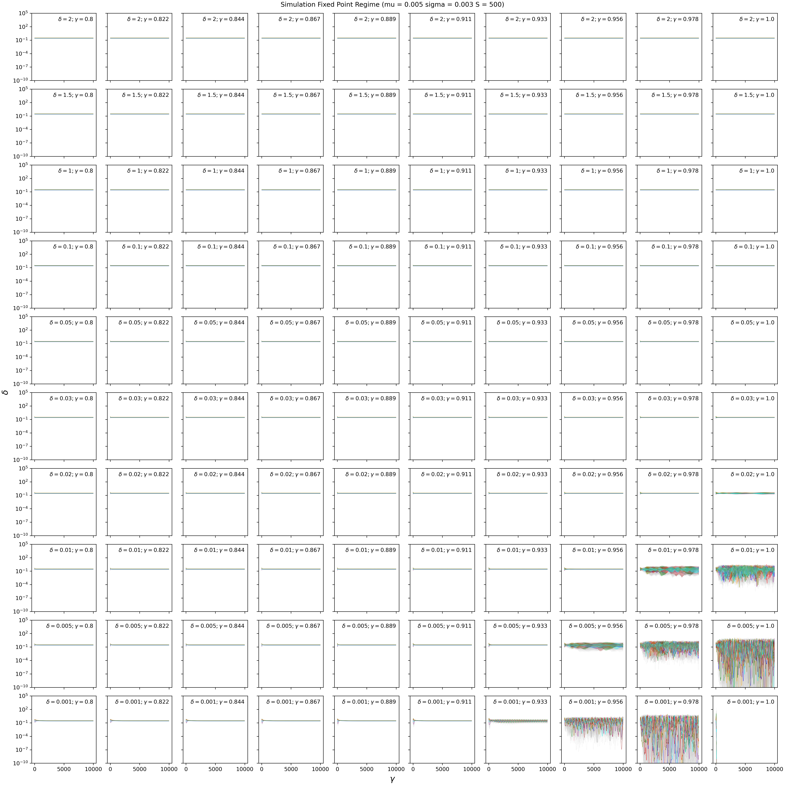
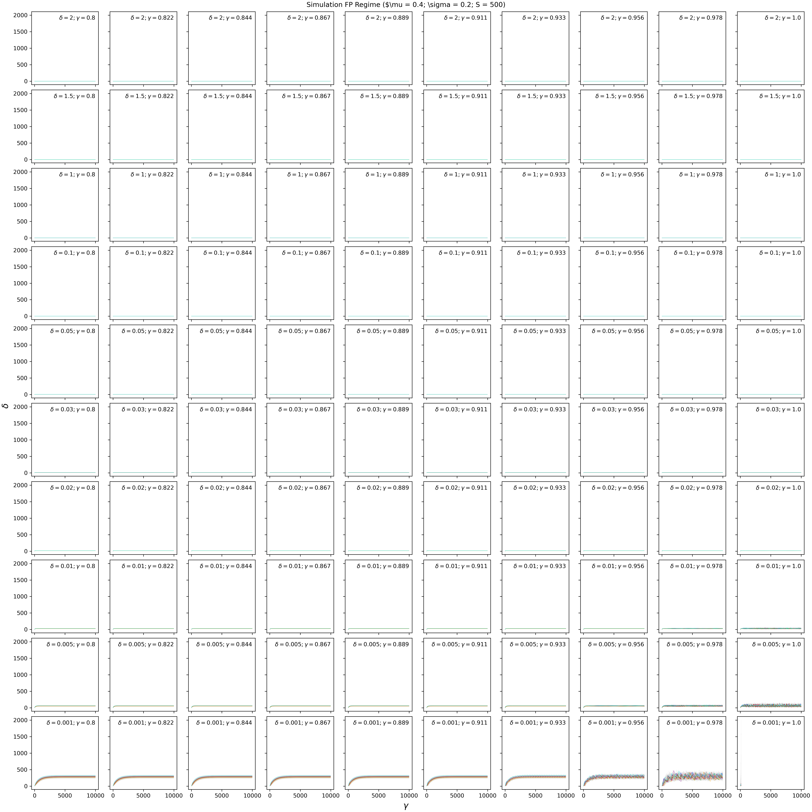
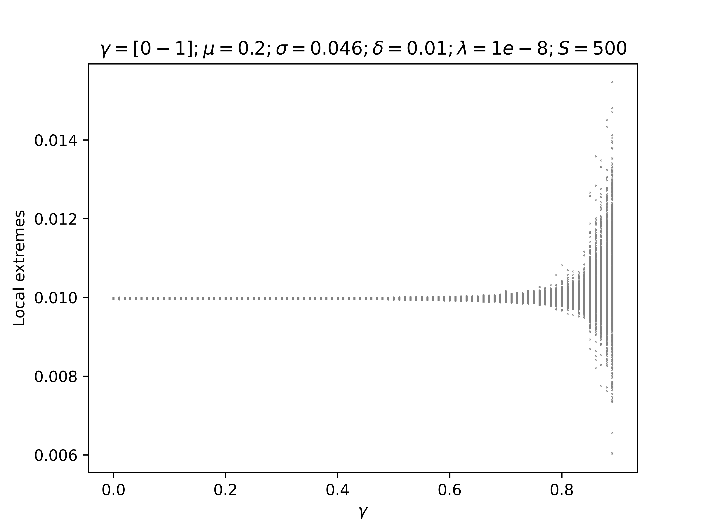
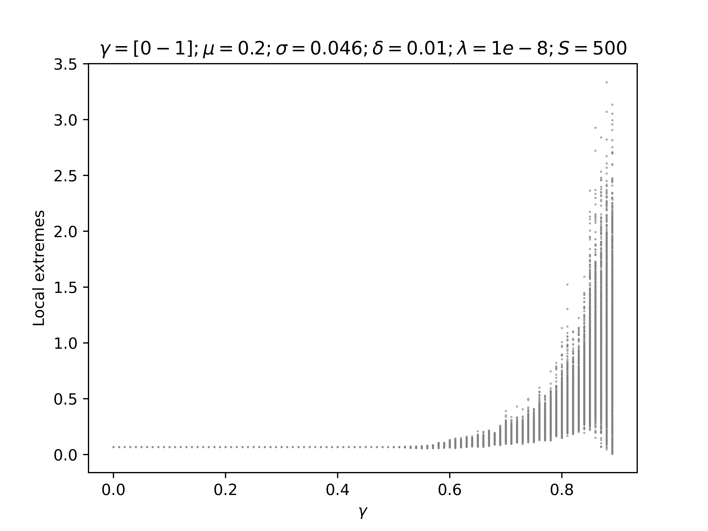
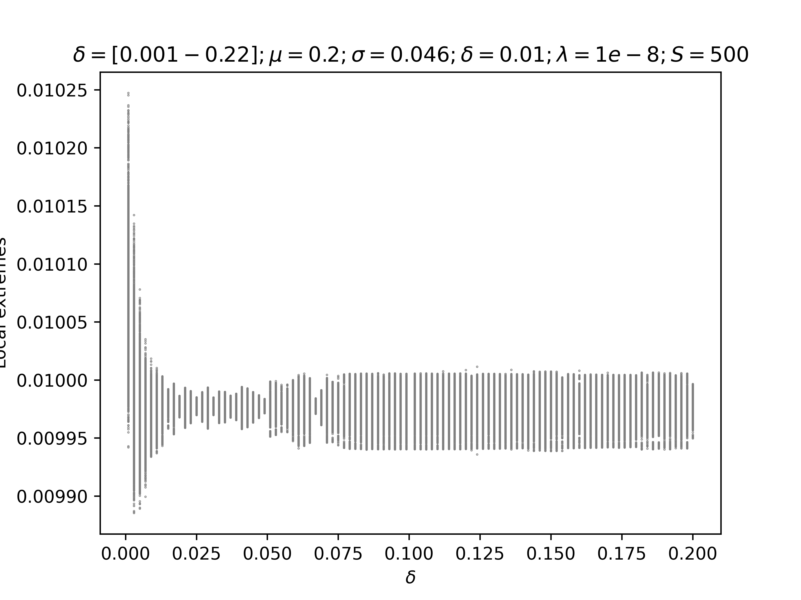
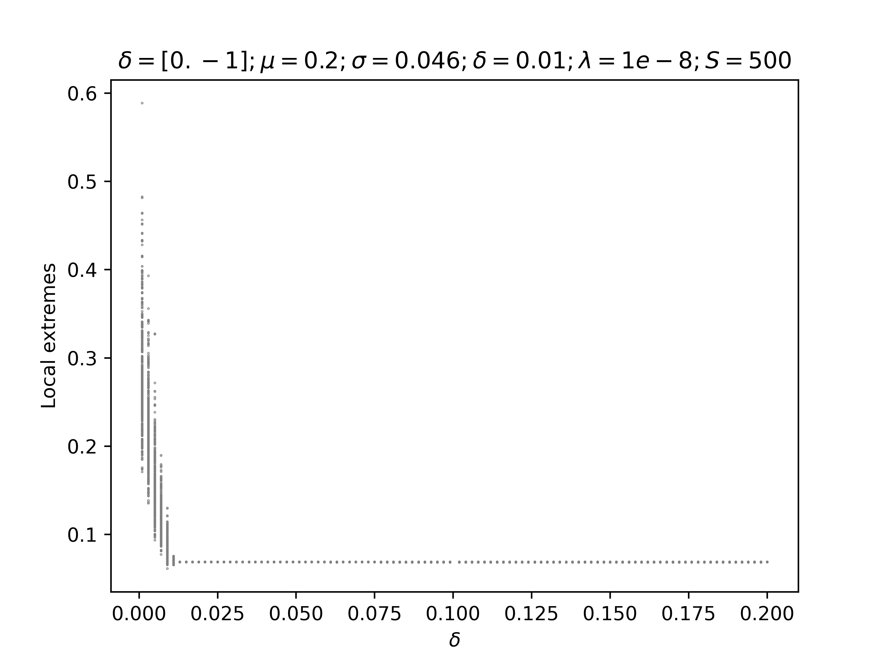

 EQUATIONS 
 
$$
\dot{n}_i = n_i\Big[ 1 - \Big(\gamma \delta a_i + (1-\gamma)n_i\Big) - \sum_{j(\neq i)} C_{ij} n_j \Big]+ \lambda

$$

$$
\dot{a}_i = n_i - \delta a_i
$$

We draw $C_{ij}\sim \mathcal{N}(\mu,\sigma)$, i.e. not with weak interaction scaling. In the end there are (beside species richness $S$) four continuous parameters to study: $\mu,\sigma,\delta,\gamma$ 

#### Changing Sigma Gammma
SIMULATIONS - Fix $\mu$ and $\delta$ and change $\gamma$ and  $\sigma$. 

We now consider the space $\mu$ and $\sigma$ as in  Ecological communities with Lotka-Volterra dynamics; DOI: https://doi.org/10.1103/PhysRevE.95.042414. In our case mu and sigma are $\hat{\mu} = S \mu$ and $\hat{\sigma} = \sqrt{S} \sigma $
In this case it will change to the Unique Fixed Points regime where the values of $\mu$ and $\sigma$ are smaller (0.005 and 0.001). The point is to change $\sigma$, to see if we get into the multiple attractor phase.

$$ 
Cij = N \sim (\mu ,\sigma) ;\  \mu=0.001;\ \sigma=[0.002-0.013];\ \gamma=[0.01-0.99];\ \delta= 0.01;\ \lambda= 1e-10\  
$$

*Memo for me: it is the folder called "Dat_SigmaGammaRK45" 

SPECIES DYNAMICS

Now I plot the same simulation but in Linear scale

AUTOTOXIN DYNAMICS

Now I plot the same simulation but in Linear scale

SIMULATIONS -Fixing $\mu$ and $\sigma$ and changing $\gamma$ and $\delta$ 

#### Fixed Point Regime 
I have parametrised the new model by using the old parameters, scaling the parameters in the new way (see. Notes Autotoxicity model by Emil). 
$$ Cij = N \sim 0.23,0.05;\ \gamma=[0-1];\ \delta= [0.001-1];\ \lambda= 0 $$

SPECIES DYNAMICS

Now the plot of the same simulation but in Linear scale

AUTOTOXIN DYNAMICS

Now the plot of the same simulation but in Linear scale

Bifurcation analysis

I tried a bifurcation analysis changing the parameter $\gamma$  from 0 to 0.89
#### Plotting the mean of all the species

#### Plotting the most abundant species

I tried a bifurcation analysis changing the parameter $\delta$  from 0.001 to 0.022
#### Plotting the mean of all the species

#### Plotting the most abundant species

Note:
Increasing the autotoxicity the switch from Fixed Point to Chaotic regime passing through oscillatory phase is faster. 
On the other end, I would expect that increasing or decreasing autotoxicity would do something also in the Chaotic Phase regime. For example biologically I expect that with high diluition of autotoxicity, so less autotoxicity, the dominant species will have more space to dominate, while with low diluition, so more autotoxicity, the dominant species will be suppressed buy his own autotoxicity. I expect that also for low production of autotoxicity. It seems that in the chaotic regime this effect of the autotoxicity is not showed with this model. Is seems that also if I produce low autotoxicity I keep being in chaotic fase, so that the interacting matrix A is most important factor. 

